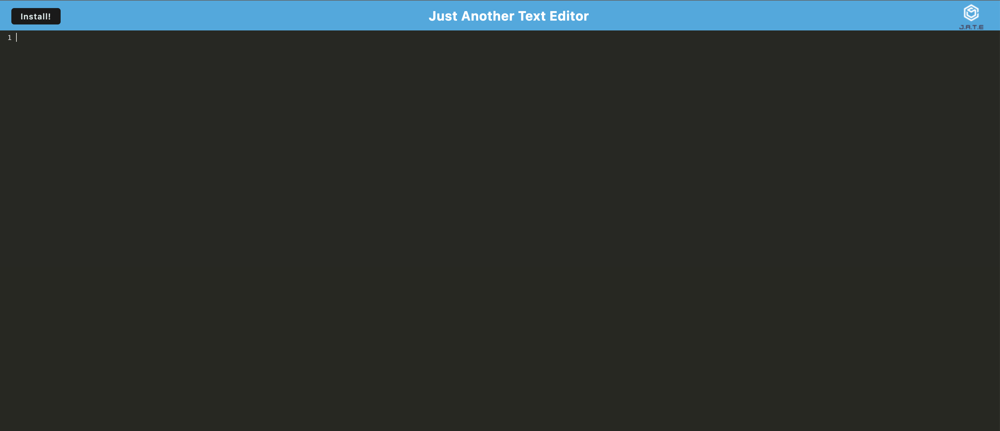

# 19 Progressive Web Applications (PWA): Text Editor

This application is a progressive web application text editor. It is a simple application that can be installed locally and used offline. 
When the application is loaded, it is a simple design with a JATE logo at the top, along with a button to install the app locally.

Here are screenshots of the deployed application.

The link to the deployed heroku application is here
https://pure-headland-51930.herokuapp.com/
